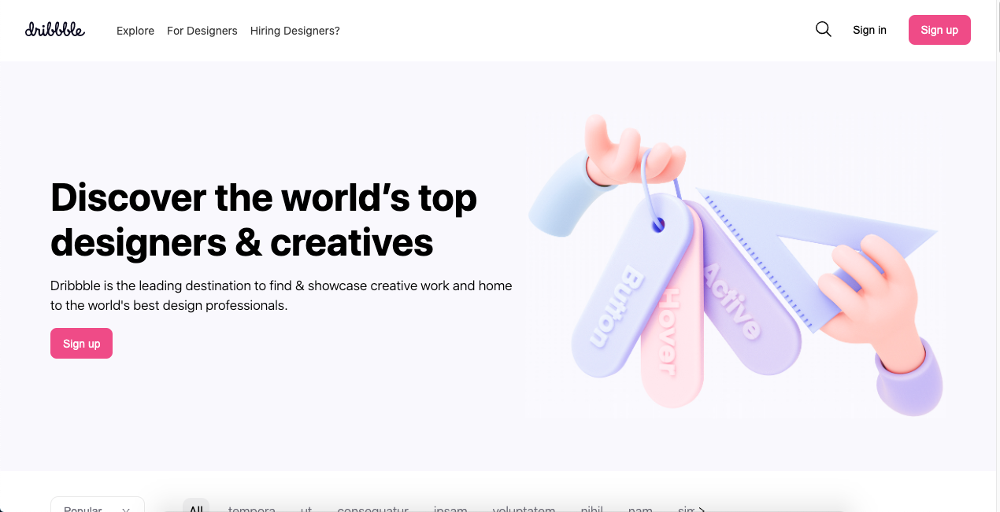
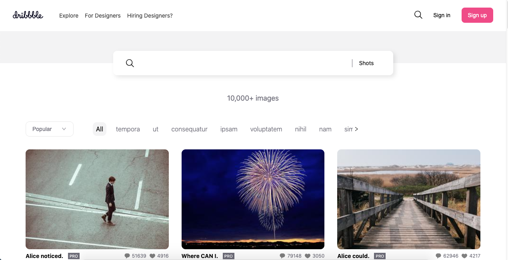

# Description
> A Dribbble clone build from scratch using React and Next.js. 

## Live Demo

[Live Demo Version](https://xtrmdarc-dribbble-react.herokuapp.com/)

## Built With

- React
- Redux
- React Router
- JS
- HTML
- CSS
- Node.js
- React-DOM
- Next-Create-App
- npm
- ES6

## How to install locally

- Clone this project into your local environment. 
- Run the command `yarn install` to install all the required dependencies.
- Run the command `yarn dev`
- Open [http://localhost:3000](http://localhost:3000) to view it in the browser.

## Available Scripts

In the project directory, you can run:

### `yarn dev`

Runs the app in the development mode. 
Open [http://localhost:3000](http://localhost:3000) to view it in the browser.

The page will reload if you make edits. 
You will also see any lint errors in the console.

### `yarn build`

Builds the app for production to the `build` folder. 
It correctly bundles React in production mode and optimizes the build for the best performance.

The build is minified and the filenames include the hashes. 
Your app is ready to be deployed!

## Authors

👤 **Diego Antonio Reyes Coronado**

- Github: [@xtrmdarc](https://github.com/xtrmdarc)
- Twitter: [@diegoreyesco](https://twitter.com/DiegoAn91629127)
- Linkedin: [diegoreyesco](https://www.linkedin.com/in/diego-reyes-coronado)

## 🤝 Contributing

Contributions, issues, and feature requests are welcome!

Feel free to check the [issues page](https://github.com/xtrmdarc/dribble-react/issues).

## Show your support

Give a ⭐️ if you like this project!
